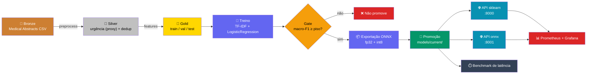

# Triagem Médica NLP


[](https://github.com/lucasbergamo/triagem_medica_nlp/actions/workflows/ci.yml)

Triagem automática de laudos médicos por urgência (`urgente` / `atencao` / `normal`), com o
ciclo de vida completo do modelo em produção — deploy, otimização de latência, monitoramento,
CI/CD e orquestração de retreino — como foco de avaliação, não a acurácia do classificador.

> **Tech Challenge Fase 03 — FIAP Pós-Tech MLET**

## Sumário

- [Arquitetura](#arquitetura)
- [Resultados](#resultados)
- [Stack](#stack)
- [Estrutura do Projeto](#estrutura-do-projeto)
- [Início Rápido](#início-rápido)
- [API de Triagem (Serving)](#api-de-triagem-serving)
- [Otimização de Latência](#otimização-de-latência)
- [Decisão de Nuvem](#decisão-de-nuvem)
- [Observabilidade](#observabilidade)
- [Orquestração (Airflow)](#orquestração-airflow)
- [Dataset](#dataset)
- [Testes](#testes)
- [Decisões de Arquitetura (ADRs)](#decisões-de-arquitetura-adrs)
- [Critérios de Avaliação](#critérios-de-avaliação)

---

## Arquitetura



Todo esse fluxo — ingestão, preparação, treino, gate de qualidade, exportação, promoção e
benchmark — roda tanto por `make <alvo>` local quanto como uma DAG do Airflow
(`airflow/dags/dag_treino_triagem.py`, ver [Orquestração](#orquestração-airflow)): a DAG é uma
casca fina sobre os mesmos módulos de `src/`, nunca uma segunda implementação da lógica.

### Decisões de modelagem

| Decisão | Por quê |
|---|---|
| TF-IDF + Logistic Regression, não Random Forest | RF exportado para ONNX serializa uma árvore por estimador — artefato dezenas de MB, inferência possivelmente mais lenta que sklearn. LogReg sobre TF-IDF vira um `Gemm`, o caso em que ONNX Runtime ganha desempenho ([ADR-0002](docs/adr/0002-classificador-tfidf-logistic-regression.md)) |
| Rótulo de urgência como proxy determinístico | Nenhum dataset público de triagem com urgência real está acessível sem credenciamento — a urgência é derivada da categoria clínica do corpus por regra auditável, declarada como proxy em toda a documentação ([ADR-0001](docs/adr/0001-rotulo-urgencia-proxy-deterministico.md)) |
| Macro-F1 como métrica principal | Classes desbalanceadas (~2,55:1) e o custo de errar "para baixo" (perder um caso urgente) é maior que o de errar "para cima" |
| Duas APIs lado a lado (sklearn e onnx) | Permite comparar os dois backends **ao vivo**, no mesmo painel do Grafana, sem rebuild — só troca a variável `MODEL_BACKEND` |

---

## Resultados

Classificador de urgência, avaliado em `data/gold/test.parquet` (1.685 laudos, nunca vistos
durante treino nem na decisão do gate de qualidade):

| Modelo | Macro-F1 | Acurácia | Tempo de treino | Tamanho do artefato |
|---|---|---|---|---|
| **LogisticRegression** (escolhido) | **0,7562** | 0,7899 | 8,08 s | 3,1 MB |
| RandomForest (baseline) | 0,7296 | 0,7751 | 4,22 s | 32,6 MB |

Por classe (test):

| Classe | Precision | Recall | F1 | Suporte |
|---|---|---|---|---|
| urgente | 0,9088 | 0,8364 | 0,8711 | 917 |
| atencao | 0,7309 | 0,7721 | 0,7509 | 408 |
| normal | 0,6073 | 0,6917 | 0,6468 | 360 |

Resultado acima da faixa de 0,55–0,68 estimada antes do treino para este corpus e este proxy de
rótulo — leitura honesta de por quê, análise de erro por matriz de confusão e limitações do
modelo em [`docs/model_card.md`](docs/model_card.md). O treino pela DAG do Airflow reproduz
esses números com uma diferença de ~0,003 (terceira casa decimal) por rodar num ecossistema de
numpy/scipy diferente do projeto — ver "Reprodutibilidade entre ambientes" no model card.

---

## Stack

| Componente | Tecnologia |
|---|---|
| Modelo | scikit-learn — TF-IDF + Logistic Regression (baseline: Random Forest) |
| Otimização de inferência | ONNX Runtime — exportação fp32 e quantização dinâmica int8 |
| Serving | FastAPI + Uvicorn, modelo carregado uma vez no `lifespan` |
| Observabilidade | Prometheus (8 métricas) + Grafana (6 painéis, provisionados como código) |
| Orquestração | Apache Airflow 3.1.5, `LocalExecutor` + Postgres |
| CI/CD | GitHub Actions — lint, testes, validação de DAG, build + smoke test |
| Containerização | Docker multi-stage (`builder`, `runtime`, `lint`, `ci`, `serve`) + docker-compose |
| Dependências | Poetry — lock file commitado |
| Configuração | Pydantic Settings + `.env` |
| Log | structlog (JSON estruturado, sem `print()`) |
| Testes | Pytest + cobertura (piso de 60%) |

---

## Estrutura do Projeto

```
triagem_medica_nlp/
├── .github/workflows/
│   ├── ci.yml                       # lint → test → dag-validate → build+smoke
│   └── release.yml                  # build multi-arch (preparado, não disparado nesta entrega)
├── airflow/
│   ├── dags/dag_treino_triagem.py   # 8 tasks, casca fina sobre src/
│   ├── Dockerfile                   # imagem própria: base oficial + requirements de ML
│   └── docker-compose.yaml          # integrado ao compose raiz sob o perfil `airflow`
├── data/{bronze,silver,gold}/       # bronze commitado (18 MB); silver/gold gerados por make data
├── docs/
│   ├── adr/0001..0007-*.md          # decisões de arquitetura registradas
│   ├── dataset.md                   # origem, licença, proxy de urgência, distribuição
│   ├── model_card.md                # métricas, comparação de modelos, limitações
│   ├── latencia.md                  # metodologia e resultados do benchmark ONNX
│   └── img/dashboard_grafana.png    # print do dashboard provisionado
├── infra/                           # reservado para IaC de um deploy futuro (ver ADR-0006)
├── metrics/                         # JSONs de avaliação e benchmark (parcialmente versionados)
├── models/current/                  # o que a API lê; publicado pela task de promoção
├── monitoring/
│   ├── prometheus/{prometheus.yml,alerts.yml}
│   └── grafana/{provisioning/...,dashboards/triagem.json}
├── scripts/
│   ├── benchmark_latency.py         # latência pura de inferência, 3 backends
│   ├── load_test.py                 # carga HTTP real, popula os painéis
│   └── validate_env.py
├── src/
│   ├── api/{main.py,metrics.py,schemas.py,middleware.py}
│   ├── data/{load.py,preprocess.py,features.py,pipeline.py,urgency_map.py}
│   ├── models/{train.py,evaluate.py,export_onnx.py,predictor.py,registry.py,store.py}
│   └── utils/{config.py,logger.py,reproducibility.py}
├── tests/                           # 84 testes: dados, modelo, predictor, API, métricas, DAG
├── Dockerfile                       # multi-stage: builder / runtime / lint / ci / serve
├── docker-compose.yml               # perfil default (api-sklearn, api-onnx, prometheus, grafana) + airflow + ci
├── Makefile                         # interface única de comandos
└── pyproject.toml
```

---

## Início Rápido

**Pré-requisitos por caminho** — os dois não pedem a mesma coisa:

- **Caminho 1 (Docker):** Docker + Docker Compose e git. Só isso — nada de Python nem Poetry
  no host. Caminho recomendado para executar e avaliar o projeto.
- **Caminho 2 (Poetry):** Python 3.11+, [Poetry](https://python-poetry.org/) **2.0 ou
  superior** (obrigatório: o `poetry.lock` deste repo usa o formato de lock do Poetry 2.x, e o
  1.8 recusa o arquivo — testado), e Docker, usado só para observabilidade e Airflow.

```bash
git clone https://github.com/lucasbergamo/triagem_medica_nlp.git
cd triagem_medica_nlp
```

O percurso completo tem 4 etapas. A Etapa 1 tem dois caminhos — Docker (recomendado, nada de
Python no host) ou Poetry — e a partir da Etapa 2 os comandos são os mesmos para os dois, porque
API, observabilidade e Airflow já rodam em container em qualquer um dos caminhos.

### Etapa 1 — Gerar o modelo

<details open>
<summary><strong>Caminho 1 — Docker (recomendado)</strong></summary>

```bash
cp .env.example .env

# Gera os artefatos do modelo (dados → treino → avaliação → export ONNX → promoção),
# rodando cada estágio em container — não precisa de Python nem Poetry no host.
make docker-pipeline
```

> **Nota — Por que gerar o modelo antes do `docker compose up`**: o estágio `serve` do
> `Dockerfile` embute `models/current/` **dentro** da imagem (o alvo de produção, ECS Fargate,
> não tem disco persistente) — sem esse diretório preenchido, o build de `api-sklearn`/`api-onnx`
> falha. O job `build` do CI segue exatamente esse mesmo roteiro (`.github/workflows/ci.yml`).

</details>

<details open>
<summary><strong>Caminho 2 — Poetry</strong></summary>

```bash
make install
cp .env.example .env
make validate       # sanity check: Python, pacotes-chave, diretórios, .env

make data            # bronze → silver → gold (download + preprocess + features)
make train           # TF-IDF + LogisticRegression, salva em models/staging/
make eval            # macro-F1, matriz de confusão, gate de qualidade
make export-onnx     # pipeline.onnx + pipeline.int8.onnx em models/staging/
make promote         # copia models/staging/ → models/current/ (só se o gate aprovou)
```

</details>

**O que esperar:** o log de `eval` (ou de `docker-pipeline`) mostra o macro-F1 (val) comparado
ao piso do gate (`MIN_MACRO_F1`, default 0,50); se aprovar, `models/current/` passa a ter 4
arquivos (`pipeline.joblib`, `pipeline.onnx`, `pipeline.int8.onnx`, `model_meta.json`) — é o que
as próximas etapas servem.

### Etapa 2 — Subir a API e a stack de observabilidade

```bash
make monitoring-up   # api-sklearn, api-onnx, prometheus e grafana — mesmo comando nos dois caminhos
```

```bash
curl http://localhost:8000/ready   # api-sklearn — confirma que o modelo carregou antes de aceitar tráfego
curl http://localhost:8001/ready   # api-onnx

curl -X POST http://localhost:8000/predict \
  -H "Content-Type: application/json" \
  -d '{"texto": "Paciente do sexo masculino, 58 anos, apresenta dor precordial em aperto com irradiação para o braço esquerdo, sudorese e dispneia associada, com início há trinta minutos."}'
```

Onde olhar agora que a stack subiu: Grafana em `localhost:3000` (`admin`/`admin`) e Prometheus
em `localhost:9090/targets` — os 6 painéis já provisionados aparecem vazios até haver tráfego
(detalhes de painéis, métricas e alertas em [Observabilidade](#observabilidade)).

> Só a API, sem Prometheus/Grafana: `make serve` (Poetry, local, `localhost:8000`) ou
> `make docker-serve-all` (as duas em container, sem observabilidade).

**O que esperar:** os dois `/ready` devolvem `200`, o `/predict` devolve uma urgência
(`urgente`/`atencao`/`normal`) com probabilidades, e `docker compose ps` mostra os 4 serviços
healthy.

### Etapa 3 — Rodar a orquestração (Airflow)

```bash
make airflow-up   # gera airflow/.env na 1ª vez, builda a imagem do Airflow (1ª vez, ~10 min) e sobe postgres, webserver, scheduler e dag-processor — localhost:8080
```

Abra `localhost:8080` — usuário e senha de admin foram gerados agora em `airflow/.env`, pelo
comando acima (ver [Orquestração](#orquestração-airflow) para onde encontrá-los). A DAG
`treino_triagem` já sobe **ativa**: entre nela e dispare direto, sem precisar despausar.

Para ver a demonstração mais forte do projeto — o gate de qualidade barrando um modelo que não
atinge o piso —, dispare de novo pela UI usando "Trigger DAG w/ config" com:

```json
{"min_macro_f1": 0.99}
```

A task `avaliacao` falha (nenhum treino real passa de 0,99 de macro-F1) e `promocao` nunca roda
— nenhum artefato novo entra em `models/current/`.

> Para validar a DAG sem abrir a UI — é o que o CI roda: `make dag-test`.

**O que esperar:** com o piso default, as 8 tasks ficam verdes e `models/current/` recebe
artefatos novos; com `min_macro_f1: 0.99`, `avaliacao` fica vermelha e o restante do grafo
(`exportacao_onnx → promocao → benchmark_latencia`) não executa. Detalhes da DAG, do isolamento
de perfil e do uid do host em [Orquestração](#orquestração-airflow).

### Etapa 4 — Qualidade (lint, testes, CI)

```bash
make docker-lint    # ruff check + ruff format --check, mesma imagem do CI
make docker-test    # 84 testes + cobertura (--cov=src), piso de 60%
```

Já rodou `make install` (Caminho 2)? `make lint` / `make test` fazem o mesmo sem container, mais
rápido.

**O que esperar:** lint sem erro e os 84 testes passando, com cobertura acima do piso de 60%. O
CI (`.github/workflows/ci.yml`) roda esses mesmos 4 jobs (`lint`, `test`, `dag-validate`,
`build`) em todo push.

---

## API de Triagem (Serving)

`FastAPI`, modelo carregado uma única vez no `lifespan` — nunca por requisição
([ADR-0003](docs/adr/0003-contrato-api-health-ready-sincrono.md)).

| Método | Rota | Papel |
|---|---|---|
| `POST` | `/predict` | Recebe o texto de um laudo, devolve urgência + confiança |
| `POST` | `/predict/batch` | Lote de 1 a 100 laudos |
| `GET` | `/health` | Liveness — processo de pé, nunca toca o modelo |
| `GET` | `/ready` | Readiness — modelo carregado e respondendo (healthcheck de ECS/ALB) |
| `GET` | `/model/info` | Backend ativo, versão do artefato, classes |
| `GET` | `/metrics` | Exposição Prometheus (OpenMetrics) |

```jsonc
// POST /predict → request
{ "texto": "Paciente apresenta dor precordial em aperto com irradiação..." }

// POST /predict → response
{
  "urgencia": "urgente",
  "confianca": 0.87,
  "probabilidades": { "normal": 0.04, "atencao": 0.09, "urgente": 0.87 },
  "latencia_inferencia_ms": 1.83,
  "backend": "sklearn",
  "modelo_versao": "2026-09-11T21:06:11.536960+00:00"
}
```

`texto` é validado por Pydantic (20 a 20.000 caracteres); fora desses limites, `422` com
mensagem em português. Falha de inferência devolve `503`, nunca um `500` mudo. `/predict/batch`
segue o mesmo contrato de item, sob a chave `resultados`.

O backend de inferência (`sklearn`, `onnx` ou `onnx-int8`) é escolhido por `MODEL_BACKEND`, lido
em runtime — a mesma imagem serve os três, sem rebuild.

---

## Otimização de Latência

Medição pura de `predictor.predict()` — sem HTTP nem serialização — via
`scripts/benchmark_latency.py --comparar`: 200 iterações de aquecimento descartadas, 1.000
medições com `time.perf_counter_ns`, amostras reais do conjunto de test.

| Backend | p50 (ms) | p95 (ms) | p99 (ms) | Speedup p95 |
|---|---|---|---|---|
| sklearn | 0,796 | 1,187 | 1,641 | 1,00x |
| onnx | 0,749 | 1,188 | 1,467 | 1,00x |
| onnx-int8 | 0,710 | 1,064 | 1,551 | 1,12x |

Ganho fim a fim modesto (12% em p95) porque o TF-IDF — Python puro nos três backends, por uma
limitação real do tokenizador do `skl2onnx`, não por falta de esforço
([ADR-0004](docs/adr/0004-exportacao-onnx-classificador-isolado.md)) — domina o tempo (~70–78%
do total, medido). Isolado, o classificador acelera de verdade (onnx-int8 é **2,33x** mais
rápido que o sklearn, e **8x menor**: 1.172,9 KB → 147,4 KB), mas nunca foi mais que ~16% do
tempo total. A decomposição completa (vetorização × classificação, componente por componente, e
o que muda sob carga concorrente) está em [`docs/latencia.md`](docs/latencia.md).

---

## Decisão de Nuvem

O objetivo da triagem é ordenar a fila de atendimento **enquanto o paciente está esperando**,
não gerar um relatório depois do fato — isso decide a arquitetura antes de qualquer detalhe de
implementação. Os três padrões de inferência em nuvem, comparados:

| Padrão | Avaliação |
|---|---|
| **Batch** | Reprovado. Um lote processado periodicamente entrega a classificação depois que a decisão de atendimento já foi tomada |
| **Serverless** (função sob demanda) | Reprovado. O cold start — dezenas de ms — domina o tempo de resposta quando a inferência em si custa menos de 1 ms |
| **Real-time (API síncrona)** | **Escolhido.** Serviço sempre ativo, modelo já carregado em memória, responde no tempo da requisição. SLO de p95 abaixo de 100 ms fim a fim |

O alvo de implantação (não provisionado nesta entrega — ver [ADR-0006](docs/adr/0006-arquitetura-nuvem-realtime.md))
seguiria o mesmo raciocínio: ECS Fargate atrás de um balanceador que só recebe tráfego depois
que `/ready` confirma o modelo carregado, exposto via API Gateway → VPC Link → NLB interno →
Fargate em subnet privada. O código local já segue os sete princípios que tornam esse caminho
barato quando percorrido (12-factor, `ModelStore` abstrato, imagem sem estado, `/health` ≠
`/ready`, log estruturado, métricas em formato padrão, retreino como grafo de dependências) —
detalhados no ADR.

---

## Observabilidade

```bash
make monitoring-up      # api-sklearn, api-onnx, prometheus e grafana, do zero — build só na primeira vez
```

- Grafana: `localhost:3000` (`admin`/`admin`) — dashboard já carregado por provisionamento, sem
  importar JSON pela UI.
- Prometheus: `localhost:9090` — alvos `api-sklearn` e `api-onnx`, scrape a cada 5s.

Os painéis nascem vazios — sem tráfego, não há nada para plotar:

```bash
make load-test          # 10 rps por 60s contra sklearn, depois o mesmo contra onnx — popula os painéis
```

`GET /metrics` expõe 8 séries Prometheus: as 4 primeiras (`ml_predictions_total`,
`ml_prediction_latency_seconds`, `ml_prediction_confidence`, `ml_active_requests`) usam o mesmo
nome e labels do material de referência da disciplina de monitoramento; as outras 4
(`ml_inference_duration_seconds`, `ml_requests_total`, `ml_errors_total`, `ml_model_info`) são
extensão deste projeto. Os buckets de latência foram recalibrados pela baseline medida
(`metrics/latency_baseline.json`, p50 0,79 ms) — o default da biblioteca começaria em 5 ms e
esconderia a curva inteira num único bucket.

O dashboard tem 6 painéis: taxa de requisições, latência HTTP (p50/p95/p99), taxa de erro,
distribuição de urgências preditas, confiança média das predições e — o que diferencia esta
entrega — **latência de inferência por backend, sklearn e onnx no mesmo gráfico**:


Três alertas em `monitoring/prometheus/alerts.yml`: p95 acima do SLO de 100 ms, taxa de erro
5xx acima de 5%, e alvo fora do ar.

Sob carga real (concorrência HTTP, não a medição in-process da seção anterior), o painel de
latência por backend mostra o sklearn ganhando dos dois backends onnx — o inverso do benchmark
in-process. As duas medições estão corretas; medem coisas diferentes, e a seção "sob carga" de
[`docs/latencia.md`](docs/latencia.md) explica o porquê com números.

**Quando terminar de explorar:**

```bash
make monitoring-down   # docker compose down — sem -v: os volumes do Prometheus e do Grafana continuam
```

---

## Orquestração (Airflow)

```bash
make airflow-up      # gera airflow/.env na 1ª vez, builda a imagem do Airflow (1ª vez, ~10 min) e sobe postgres, webserver, scheduler e dag-processor — localhost:8080
```

`make airflow-up` gera `airflow/.env` automaticamente na primeira vez, a partir de
`airflow/.env.example`, com os segredos (senha do Postgres, senha do admin, chave Fernet, dois
secrets de API) preenchidos na hora — a senha do admin da UI fica dentro desse arquivo. Rodar de
novo não sobrescreve um `airflow/.env` já existente.

A DAG `treino_triagem` já sobe **ativa e agendada** (`AIRFLOW__CORE__DAGS_ARE_PAUSED_AT_CREATION:
"false"`) — diferente do default do Airflow, pensado para ambientes com dezenas de DAGs, onde
subir tudo já ativo seria arriscado. Aqui só existe uma DAG, num projeto feito para ser executado
e avaliado: com o default, um trigger pela UI logo após o primeiro `make airflow-up` ficaria
parado em "queued" sem nenhuma explicação. Abra `localhost:8080`, entre em `treino_triagem` e
dispare direto — não precisa despausar antes.

Airflow 3.1.5, executor `LocalExecutor` + Postgres — decisão e alternativas descartadas em
[ADR-0005](docs/adr/0005-airflow-3-local-executor.md). Roda sob o perfil `airflow` do compose
raiz, isolado do perfil default: as duas stacks não sobem juntas por padrão (memória limitada no
ambiente de desenvolvimento local), e nenhuma depende da outra estar de pé.

Os alvos `make airflow-*` já exportam `AIRFLOW_UID` com o uid de quem chama o make — sem isso,
o container roda com o uid do Airflow (50000) e os artefatos que a DAG escreve em `data/`,
`models/` e `metrics/` (montados por volume) saem com dono diferente do seu usuário no host,
o que quebra as tasks de treino e promoção com `PermissionError`.

A DAG `treino_triagem` (`airflow/dags/dag_treino_triagem.py`) tem 8 tasks, cada uma uma casca
fina sobre um módulo de `src/` ou `scripts/` — a mesma função que `make train`, `make eval` etc.
chamam localmente:

```
prep_execution → ingestao → preparacao → treino → avaliacao ──(gate macro-F1)──→
    exportacao_onnx → promocao → benchmark_latencia
```

`avaliacao` é o gate: macro-F1 (val) abaixo do piso (`MIN_MACRO_F1`, sobrescrevível por
`dag_run.conf["min_macro_f1"]`) faz a task falhar e nenhum artefato é promovido — `promocao` é a
única escrita em `models/current/` de todo o projeto, e só roda se o gate aprovou.
`benchmark_latencia` roda **depois** da promoção, não antes — motivo registrado no ADR-0005.

Correspondência com a DAG de referência da disciplina (`prepare → train → evaluate → deploy`):

| Referência | Tasks deste projeto |
|---|---|
| `prepare` | `ingestao` + `preparacao` |
| `train` | `treino` |
| `evaluate` | `avaliacao` (mesmo padrão de gate: levanta exceção se a métrica não atinge o piso) |
| `deploy` | `exportacao_onnx` + `promocao` |
| — | `benchmark_latencia` (extensão deste projeto, sem equivalente na referência) |

> Para validar a DAG sem abrir a UI — é o que o CI roda:
> ```bash
> make dag-test        # valida a DAG (DagBag sem erro de import, 8 tasks, dependências)
> ```

**Quando terminar de explorar:**

```bash
make airflow-down     # docker compose down — sem -v: o volume do Postgres do Airflow continua
```

---

## Dataset

Documentação completa em [`docs/dataset.md`](docs/dataset.md).

- **Medical Abstracts TC Corpus**: 14.438 abstracts médicos rotulados por categoria clínica,
  público, sem login nem API key.
- Rótulo de urgência (`urgente`/`atencao`/`normal`) é um **proxy determinístico**, derivado da
  categoria clínica — não um rótulo de triagem validado clinicamente
  ([ADR-0001](docs/adr/0001-rotulo-urgencia-proxy-deterministico.md)). Não deve ser usado para
  decisão médica real.
- 11.227 laudos únicos após resolução de multi-rótulo (regra: a maior urgência vence), split
  estratificado 70/15/15 — 7.858 treino, 1.684 validação, 1.685 teste.
- CSVs brutos commitados em `data/bronze/` — `make data` reconstrói silver e gold offline, sem
  depender de rede nem de um remote externo.

---

## Testes

```bash
make test        # 84 testes, com relatório de cobertura (--cov=src)
```

Cobrem: mapa de urgência e resolução de multi-rótulo, pipeline de dados (dedup, split
estratificado), treino e gate de qualidade do modelo, equivalência entre os 3 backends de
inferência, contratos da API (200/422/503, `/health` × `/ready`, endpoints síncronos), métricas
Prometheus e a DAG do Airflow (roda só dentro da imagem de `airflow/` — fora dela,
`pytest.importorskip("airflow")` pula o arquivo). Nenhum teste depende de artefato gerado
previamente: modelos usados em teste são fixtures treinadas na hora, em `tmp_path`.

---

## Decisões de Arquitetura (ADRs)

| ADR | Decisão |
|---|---|
| [0001](docs/adr/0001-rotulo-urgencia-proxy-deterministico.md) | Rótulo de urgência como proxy determinístico a partir da categoria clínica |
| [0002](docs/adr/0002-classificador-tfidf-logistic-regression.md) | TF-IDF + Logistic Regression, não Random Forest |
| [0003](docs/adr/0003-contrato-api-health-ready-sincrono.md) | Contrato da API: `/health` ≠ `/ready`, endpoints síncronos |
| [0004](docs/adr/0004-exportacao-onnx-classificador-isolado.md) | Exportação ONNX: classificador isolado, TF-IDF em Python |
| [0005](docs/adr/0005-airflow-3-local-executor.md) | Airflow 3.1.5 com `LocalExecutor` |
| [0006](docs/adr/0006-arquitetura-nuvem-realtime.md) | Arquitetura de nuvem: inferência em tempo real |
| [0007](docs/adr/0007-escopo-sem-dvc-nem-mlflow.md) | Escopo de dados e experimentos: sem DVC nem MLflow |

---

## Critérios de Avaliação

Mapeamento direto do critério do enunciado para onde a evidência está no projeto:

| Critério | Peso | Onde está a evidência |
|---|---|---|
| Modelagem e Otimização | 20% | [Resultados](#resultados), [Otimização de Latência](#otimização-de-latência), `docs/model_card.md`, `docs/latencia.md` — TF-IDF+LogReg, gate de qualidade (`src/models/evaluate.py`), 3 backends de inferência |
| Monitoramento | 20% | [Observabilidade](#observabilidade) — `src/api/metrics.py` (8 séries), `monitoring/`, dashboard provisionado como código, print em `docs/img/` |
| CI/CD (GitHub Actions) | 15% | `.github/workflows/ci.yml` — 4 jobs: `lint`, `test`, `dag-validate`, `build` (com smoke test real) |
| Orquestração (Airflow) | 15% | [Orquestração](#orquestração-airflow) — `airflow/dags/dag_treino_triagem.py`, 8 tasks, gate de promoção |
| Documentação (README) | 15% | Este arquivo, `docs/dataset.md`, `docs/model_card.md`, `docs/latencia.md`, [ADRs](#decisões-de-arquitetura-adrs) |
| Vídeo STAR | 15% | Link de entrega (fora do repositório) |
