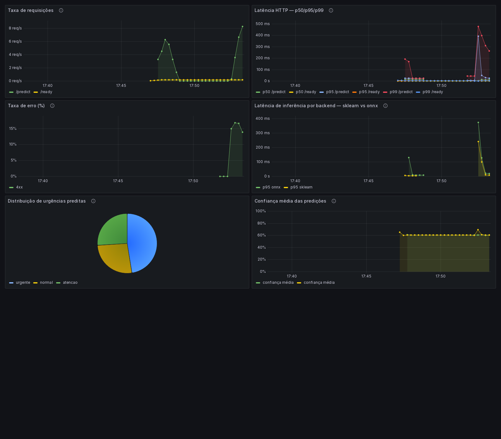

# Triagem Médica NLP

> Tech Challenge Fase 03 — FIAP Pós-Tech MLET. Triagem automática de laudos médicos por
> urgência, com o ciclo de vida completo do modelo (deploy, monitoramento, CI/CD, orquestração)
> como foco de avaliação — não a acurácia do classificador.

**Este README ainda está em construção.** Badges, diagrama de arquitetura completo e o mapa
dos 6 critérios do enunciado são escritos ao final, quando cada peça já estiver implementada.
Até lá, as decisões de cada etapa ficam documentadas em `docs/` (dataset, model card, ADRs)
conforme os arquivos entram no repo.

## Status

Em construção, bloco por bloco. Ver `CLAUDE.md` para as regras de execução.

## Setup rápido (dev local)

```bash
make install     # poetry install
cp .env.example .env
make validate    # sanity check: Python, pacotes, diretórios, .env
make lint
make test
```

## Docker (paridade CI)

```bash
docker compose --profile ci build
docker compose --profile ci run --rm lint
docker compose --profile ci run --rm ci
```

## API

`FastAPI`, modelo carregado uma única vez no `lifespan` — nunca por requisição.

```bash
make train && make eval && make export-onnx && make promote   # gera os 3 artefatos em models/current/
make serve                                 # uvicorn local, localhost:8000 (MODEL_BACKEND do .env)
# ou
make docker-serve                          # api-sklearn, localhost:8000
make docker-serve-onnx                     # api-onnx, localhost:8001 (MODEL_BACKEND=onnx)
make docker-serve-all                      # as duas de pé ao mesmo tempo, portas diferentes
```

O backend de inferência (`sklearn`, `onnx` ou `onnx-int8`) é escolhido por `MODEL_BACKEND`,
lido em runtime — a mesma imagem serve os três, sem rebuild.

| Método | Rota | Papel |
|---|---|---|
| `POST` | `/predict` | Recebe o texto de um laudo, devolve urgência + confiança |
| `POST` | `/predict/batch` | Lote de 1 a 100 laudos |
| `GET` | `/health` | Liveness — processo de pé, nunca toca o modelo |
| `GET` | `/ready` | Readiness — modelo carregado e respondendo (healthcheck de ECS/ALB) |
| `GET` | `/model/info` | Backend ativo, versão do artefato, classes |

```jsonc
// POST /predict → request
{ "texto": "Paciente apresenta dor precordial em aperto com irradiação..." }

// POST /predict → response
{
  "urgencia": "urgente",
  "confianca": 0.87,
  "probabilidades": { "normal": 0.04, "atencao": 0.09, "urgente": 0.87 },
  "latencia_inferencia_ms": 1.83,
  "backend": "sklearn",
  "modelo_versao": "2026-09-11T21:06:11.536960+00:00"
}
```

`texto` é validado por Pydantic (20 a 20.000 caracteres); fora desses limites, `422` com
mensagem em português. Falha de inferência devolve `503`, nunca um `500` mudo. `/predict/batch`
segue o mesmo contrato de item, sob a chave `resultados`.

Todos os endpoints — inclusive os dois de inferência — são `def`, nunca `async def`: a
inferência (TF-IDF + regressão logística) é CPU-bound e síncrona, e dentro de uma coroutine
ela bloquearia o event loop, enfileirando todas as requisições concorrentes. Com `def`, o
FastAPI despacha a chamada para o threadpool do Starlette, liberando o event loop — é o que
mantém a medição de latência sob carga válida.

### Latência de inferência — sklearn, onnx e onnx-int8

Medição pura de `predictor.predict()` — sem HTTP nem serialização — via
`scripts/benchmark_latency.py --comparar`: 200 iterações de aquecimento descartadas, 1.000
medições com `time.perf_counter_ns`, amostras reais do conjunto de test.

| Backend | p50 (ms) | p95 (ms) | p99 (ms) | Speedup p95 |
|---|---|---|---|---|
| sklearn | 0,796 | 1,187 | 1,641 | 1,00x |
| onnx | 0,749 | 1,188 | 1,467 | 1,00x |
| onnx-int8 | 0,710 | 1,064 | 1,551 | 1,12x |

Ganho fim a fim modesto (12% em p95) porque o TF-IDF — Python puro nos três backends, por uma
limitação real do tokenizador do `skl2onnx`, não por falta de esforço — domina o tempo
(~70-78% do total, medido). Isolado, o classificador acelera de verdade (onnx-int8 é **2,33x**
mais rápido que o sklearn, e **8x menor**: 1.172,9 KB → 147,4 KB), mas nunca foi mais que ~16%
do tempo total, e o footprint total em disco dos backends onnx **não** encolhe — eles ainda
dependem do `pipeline.joblib` inteiro para o TF-IDF, então ficam 5-18% *maiores* que o
sklearn, não menores. A decomposição completa (vetorização x classificação, componente por
componente) está em [`docs/latencia.md`](docs/latencia.md).

## Decisão de nuvem — real-time, não batch nem serverless

O objetivo da triagem é ordenar a fila de atendimento **enquanto o paciente está esperando**,
não gerar um relatório depois do fato. Isso decide a arquitetura antes de qualquer detalhe de
implementação — os três padrões de inferência em nuvem, comparados:

| Padrão | Avaliação |
|---|---|
| **Batch** | Reprovado. Um lote processado periodicamente entrega a classificação depois que a decisão de atendimento já foi tomada — o resultado chega tarde demais para servir ao propósito do produto. |
| **Serverless** (função sob demanda) | Reprovado. O cold start de uma função fria — dezenas de milissegundos — domina o tempo de resposta quando a inferência em si custa menos de 1 ms (ver tabela acima): o overhead de infraestrutura passaria a ser o gargalo, exatamente o que a otimização de latência deste projeto existe para eliminar. |
| **Real-time (API síncrona)** | **Escolhido.** Um serviço sempre ativo, com o modelo já carregado em memória, responde no tempo da requisição. É o único padrão compatível com um SLO de latência apertado (p95 abaixo de 100 ms fim a fim) e com a separação `/health`/`/ready` que permite reciclar instâncias sem impacto no tráfego. |

Consequência direta desta escolha: a API carrega o modelo uma única vez no `lifespan` e o
mantém em memória — recarregar por requisição reintroduziria exatamente o tipo de overhead que
o padrão serverless tem por natureza. O alvo de implantação segue o mesmo raciocínio: um
serviço containerizado sempre ativo (ECS Fargate), atrás de um balanceador que só recebe
tráfego depois que `/ready` confirma o modelo carregado — nunca uma função efêmera por
requisição.

## Observabilidade

```bash
make monitoring-up      # api-sklearn, api-onnx, prometheus e grafana, do zero
make load-test          # popula os painéis com tráfego real contra os dois backends
```

- Grafana: `localhost:3000` (`admin`/`admin`) — dashboard já carregado por provisionamento,
  sem importar JSON pela UI.
- Prometheus: `localhost:9090` — alvos `api-sklearn` e `api-onnx`, scrape a cada 5s.

`GET /metrics` expõe 8 séries Prometheus: as 4 primeiras (`ml_predictions_total`,
`ml_prediction_latency_seconds`, `ml_prediction_confidence`, `ml_active_requests`) usam o
mesmo nome e labels do material de referência da disciplina de monitoramento; as outras 4
(`ml_inference_duration_seconds`, `ml_requests_total`, `ml_errors_total`, `ml_model_info`) são
extensão deste projeto. Os buckets de latência (`0.00005` a `1.0` segundo) foram recalibrados
pela baseline medida (`metrics/latency_baseline.json`, p50 0,79 ms) — o default da biblioteca
começaria em 5 ms e esconderia a curva inteira num único bucket.

O dashboard tem 6 painéis: taxa de requisições, latência HTTP (p50/p95/p99), taxa de erro,
distribuição de urgências preditas, confiança média das predições e — o que diferencia esta
entrega — **latência de inferência por backend, sklearn e onnx no mesmo gráfico**:



Três alertas em `monitoring/prometheus/alerts.yml`: p95 acima do SLO de 100 ms (§ decisão de
nuvem acima), taxa de erro 5xx acima de 5%, e alvo fora do ar.

Sob carga real (concorrência de requisições HTTP, não a medição in-process da seção de
latência acima), o painel 4 mostra o sklearn ganhando dos dois backends onnx — o inverso do
benchmark in-process. As duas medições estão corretas; medem coisas diferentes, e a seção
"sob carga" de [`docs/latencia.md`](docs/latencia.md) explica o porquê com números.
